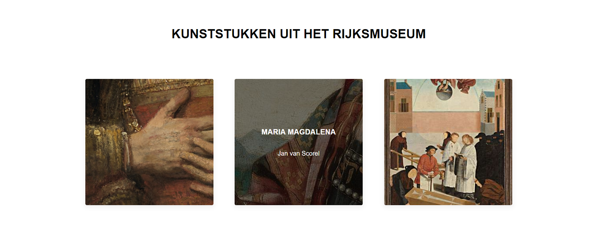
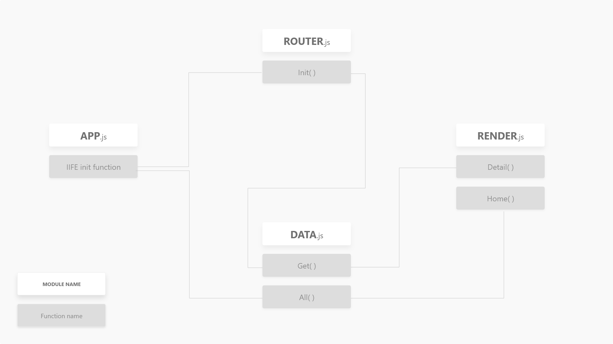
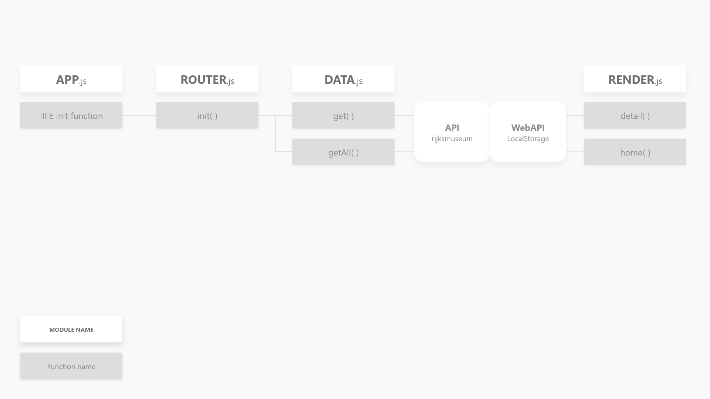
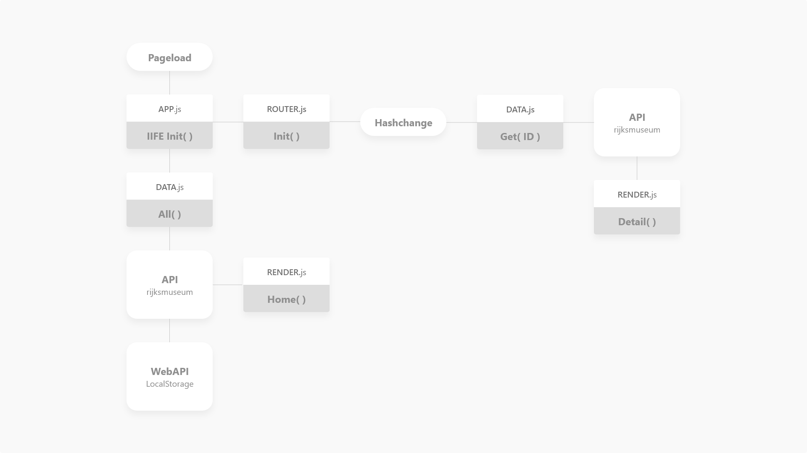
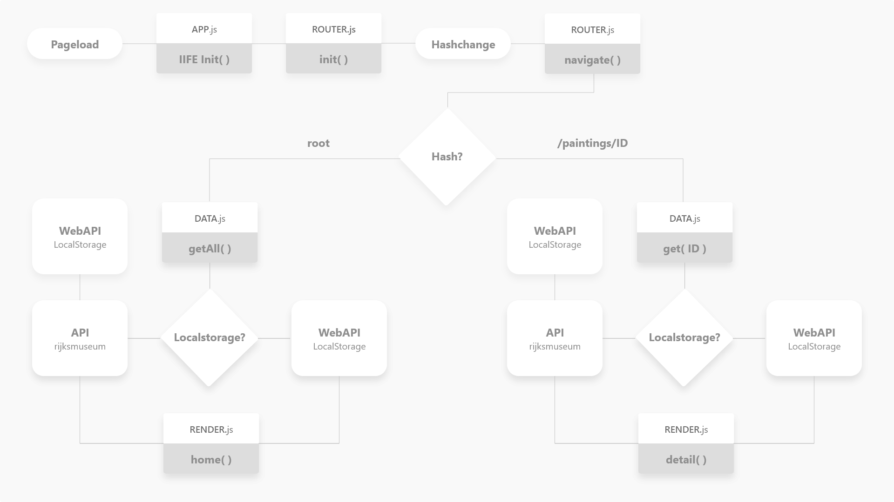

# ARTGALLERY EXPERIENCE

## Summary
A single page web application made from scratch (currently without any libraries). Language of the product is currently in Dutch, adding support for English soon.
Content served on a front page with art objects from the [Rijksmuseum API](https://www.rijksmuseum.nl/nl/api).



## Table of contents
1. [Live demo](#1-Live-demo)
2. [Install](#2-Install)
3. [Features](#3-Features)
4. [API](#4-API)
5. [Actor Diagram](#5-Actor-Diagram)
6. [Interaction](#6-Interaction)
7. [Design decisions](#7-Design-decisions)
8. [To-do](#8-To-do)

[License](#License)

## 1. Live demo
Check the live site [here](https://follywolly.github.io/web-app-from-scratch-18-19/src).

## 2. Install
This project currently doesn't have any dependencies, so you can just fork it and clone it to your device.
The javascript code is written in ES6, and thus is not viable for production purposes yet.
Launch the src folder from a http server and you are good to go.
```bash
git clone https://github.com/your-user-name/web-app-from-scratch-18-19/src
```

## 3. Features
- Landing page with art objects loaded in from the [Rijksmuseum API](https://www.rijksmuseum.nl/nl/api).
- Detailpages for each art object
- Very, very, very basic router
- Start of a virtual DOM

## 4. API
The data that populates this product is served by the [Rijksmuseum API](https://www.rijksmuseum.nl/nl/api).
This API returns artobjects currently in their collection as JSON.
You can fetch all art objects and more details of each individual art piece.

By default, the API returns 20 art pieces per request. You can change this however, by adding &ps=NUMBER in the request URL.

Besides this restriction, I haven't encountered any restrictions yet.

Connecting to the API:
```js
// Fetch all artobjects, 20 at a time. add &ps=NUMBER to load in more at a time
fetch('https://www.rijksmuseum.nl/api/nl/collection?key=YOUR-API-KEY&format=json')
  .then(raw => raw.json())
  .then(data => {
    // do something with the data
  })

// Fetch single art piece
fetch('https://www.rijksmuseum.nl/api/nl/collection/ART-OBJECT-NUMBER?key=YOUR-API-KEY&format=json')
  .then(raw => raw.json())
  .then(data => {
    // do something with the data
  })
```
## 5. Actor Diagram
The main flow of the code in this application is described in the diagram below.
<details>
  <summary>Week 1</summary>
  
</details>   
Week 2



## 6. Interaction
The main interaction flow of the code in this applications is described in the diagram below.

<details>
  <summary>Week 1</summary>
  
</details>   
Week 2



Clearly, there's some work to be done to make data and render functions more dynamic.

## 7. Design decisions
Currently the design is very minimalistic, to really let the images of the art objects speak for itself.
On desktop, the landing page shows three paintings at a time horizontally, to represent the feeling of an art gallery. When switching to the next three paintings a slide animation occurs, giving the feeling of moving to a next room. This was done to really represent the feeling of an art gallery, as the main focus of this product is showing off the art objects from the Rijksmuseum's current collection.

## 8. To-do
- [x] Make connection with the API
- [x] Render landing page with all art objects
- [x] Render detail pages
- [x] Divide codebase into modules
- [x] Make basic router
- [x] Actor diagram
- [x] Interaction diagram
- [x] Return to home button from detailpage
- [x] Adding url catch features to the router
- [x] Add multiple routes
- [ ] Make detail pages listen to the artworks colors (colors provided by the API)
- [ ] Adding a template engine (or making one)
- [ ] Virtual dom
- [ ] Support English & Dutch language

## License
[MIT](LICENSE) © [Folkert-Jan van der Pol](https://folkertjan.nl/)
