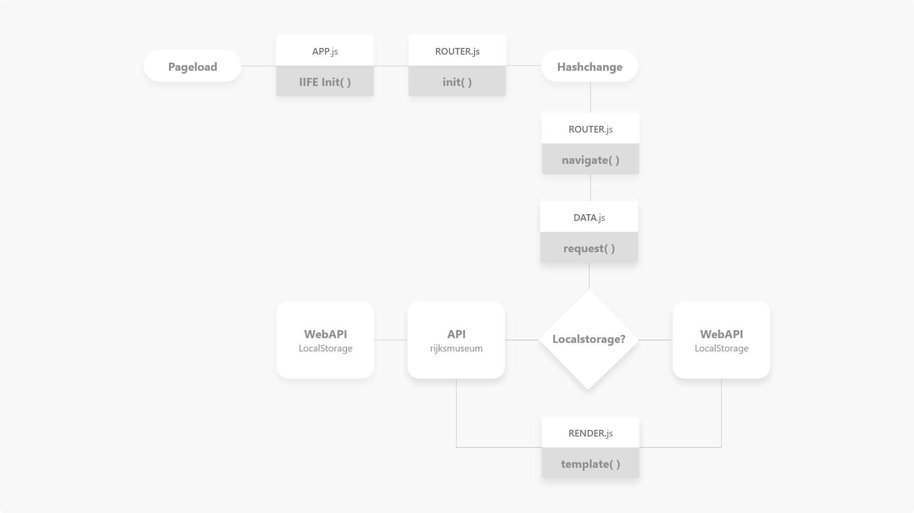
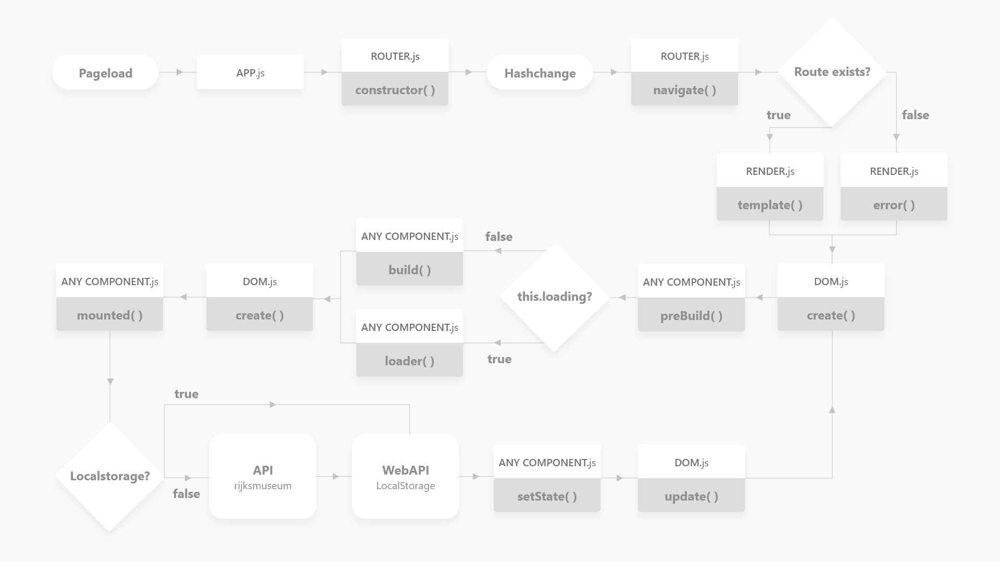

# ARTGALLERY EXPERIENCE

## Summary
A single page web application made from scratch (currently without any libraries). You can view artobject descriptions in both Dutch and English.
Content served on a front page with art objects from the [Rijksmuseum API](https://www.rijksmuseum.nl/nl/api).


## Table of contents
1. [Live demo](#1-Live-demo)
2. [Install](#2-Install)
3. [Features](#3-Features)
4. [API](#4-API)
5. [Actor Diagram](#5-Actor-Diagram)
6. [Interaction](#6-Interaction)
7. [Code examples](#7-Code-examples)
    1. [Router](#71-Router)
    2. [Components](#72-Components)
8. [Design decisions](#8-Design-decisions)
9. [To-do](#9-To-do)

[Sources](#Sources-used)     
[License](#License)

## 1. Live demo
Check the live site [here](https://follywolly.github.io/web-app-from-scratch-18-19/src).

## 2. Install
This project currently doesn't have any dependencies, so you can just fork it and clone it to your device.
The javascript code is written in ES6, and thus is not viable for production purposes yet.
Launch the src folder from a http server and you are good to go.
```bash
git clone https://github.com/your-user-name/web-app-from-scratch-18-19/src
```

## 3. Features
- Landing page with art objects loaded in from the [Rijksmuseum API](https://www.rijksmuseum.nl/nl/api).
- Detailpages for each art object
- Basic router
- Virtual DOM
- Loading states
- Simple component lifecycle system

## 4. API
The data that populates this product is served by the [Rijksmuseum API](https://www.rijksmuseum.nl/nl/api).
This API returns artobjects currently in their collection as JSON.
You can fetch all art objects and more details of each individual art piece.

By default, the API returns 20 art pieces per request. You can change this however, by adding &ps=NUMBER in the request URL.

Besides this restriction, I haven't encountered any restrictions yet.

Connecting to the API:
```js
// Fetch all artobjects, 20 at a time. add &ps=NUMBER to load in more at a time
fetch('https://www.rijksmuseum.nl/api/nl/collection?key=YOUR-API-KEY&format=json')
  .then(raw => raw.json())
  .then(data => {
    // do something with the data
  })

// Fetch single art piece
fetch('https://www.rijksmuseum.nl/api/nl/collection/ART-OBJECT-NUMBER?key=YOUR-API-KEY&format=json')
  .then(raw => raw.json())
  .then(data => {
    // do something with the data
  })
```
## 5. Actor Diagram
The main flow of the code in this application is described in the diagram below.
<details>
<summary>Legend</summary>


</details>

<details>
<summary>Week 1</summary>


</details>

<details>
<summary>Week 2</summary>


</details>

<details open>
<summary>Week 3</summary>


</details>

## 6. Interaction
The main interaction flow of the code in this applications is described in the diagram below.

<details>
<summary>Legend</summary>


</details>

<details>
<summary>Week 1</summary>


</details>

<details>
<summary>Week 2 - First Version</summary>


</details>   

<details>
<summary>Week 2 - Second Version</summary>


</details>

<details open>
<summary>Week 3</summary>


</details>

## 7. Code examples
### 7.1 Router
```js
import Router from 'router.js'
import Home from 'home.js' // page component
import Detail from 'Detail.js' // page component

const router = new Router()

// adding a basic route, including the route to listen for and the template component to render
router.add({
  href: '/',
  temp: () => new Home()
})

router.add({
  href: '/paintings/:id',
  temp: id => new Detail(id), // you can pass parameters from the url parameters to templates
  callback: () => console.log('this is a detail page') // callbacks (can be single or array) will fire after rendering the new page (currently a gimmick)
})

// you can also add multiple routes in one function call:
router.add([
  {/*route*/},
  {/*route*/}
])
```
### 7.2 Components
#### 7.2.1 Simple component with mounted hook
```js
import Component from 'component.js'

class Account extends Component {
  constructor(props) {
    super(props)
    this.state = { // you can have state
      data: {
        firstword: 'Hello',
        secondword: 'World'
      }
    }
    // list of build in properties and methods you shouldn't override:
    // this.id
    // this.domHandler{}
    // this.helper{}
    // this.mounted()
    // this.preBuild()
    // this.loader()
    // this.setState()

  }
  build() { // make the components virtual template (gets used by automatic rendering)
    const v = this.domHandler.virtualize

    // code below will return {type: 'div', props: {}, children: [{type: 'h1', props: {'attribute': 'value'}, 'Hello World'}]}
    // which builds to the DOM like: <div><h1 attribute="value">Hello World</h1></div>
    return v('div', {},
      v('h1', {'attribute': 'value'}, `${this.state.data.firstword} ${this.state.data.secondword}`)
    )
  }
}
```

#### 7.2.2 Bit more advanced component with mounted hook and loading state
```js
import Component from 'component.js'

class Login extends Component {
  constructor(props) {
    super(props)
    this.state = { // you can have state
      text: ''
    }
    this.loading = true // built in property to use built in loader() template function on render instead of build()

  }
  async mounted() { // gets called immediately after rendering of the component
    if (this.loading){
      const data = await fetch('someurl') // let's say this returns 'Hello World' after a few seconds
      this.loading = false // comes before setState since setState will trigger re-render
      this.setState({data}) // you can update state (component rerenders upon state change)
      this.store.setState({data}) // you can update the general state via the store
    }
    this.store.watch('someproperty', (val) => {
      console.log('someproperty has changed: ', val) // do something upon value change of anything in the store state
    }, this.id)
  }
  loader() { // when this.loading is set to true, the loader function will be called instead of the build function upon render
    const v = this.domHandler.virtualize
    // code below will return {type: 'div', props: {'class': 'loader'}, children: [{type: 'h3', props: {}, children: 'Loading...'}, {type: 'p', props: {}, children: 'We thank you for your patience']}
    // which builds to the DOM like: <div class="loader"><h3>Loading...</h3><p>We thank you for your patience</p></div>
    return v('div', {'class': 'loader'},
      v('h3', {}, 'Loading..'),
      v('p', {}, 'We thank you for your patience')
    )
  }
  build() { // will be called when this.loading is set to false
    const v = this.domHandler.virtualize

    // code below will return {type: 'div', props: {}, children: [{type: 'h1', props: {'attribute': 'value'}, children: 'Hello World'}]}
    // which builds to the DOM like: <div><h1 attribute="value">Hello World</h1></div>
    return v('div', {},
      v('h1', {'attribute': 'value'}, this.state.text)
    )
  }
}
```

## 7. Design decisions
Users can browse artobjects from the Rijksmuseum by switching between three artobjects at a time (on desktop). This is supposed to give people the feeling of being in a room within the Rijksmuseum, seeing only a few artobjects on a wall. Users can search artobjects or makers,
## 8. To-do
- [x] Make connection with the API
- [x] Render landing page with all art objects
- [x] Render detail pages
- [x] Divide codebase into modules
- [x] Make basic router
- [x] Actor diagram
- [x] Interaction diagram
- [x] Return to home button from detailpage
- [x] Adding url catch features to the router
- [x] Add multiple routes
- [x] Virtual DOM
- [x] Component based Virtual DOM
- [x] Make data component-scoped
- [x] Store watcher
- [x] Support English & Dutch language
- [ ] Diffing algorithm to efficiently update the DOM


## Sources used
- [How to write your own virtual dom](https://medium.com/@deathmood/how-to-write-your-own-virtual-dom-ee74acc13060) by deathmood - The base and most inspiration for DOM and Render class came from here
- [Hashchange events in javascript](https://developer.mozilla.org/en-US/docs/Web/Events/hashchange) by MDN
- [Classes in javascript](https://developer.mozilla.org/en-US/docs/Web/JavaScript/Reference/Statements/class) by MDN
- [Object.protorype.watch()](https://developer.mozilla.org/en-US/docs/Web/JavaScript/Reference/Global_Objects/Object/watch) by MDN - inspiration for store watcher function started here
- [Rijksmuseum API](https://www.rijksmuseum.nl/nl/api)

## License
[MIT](LICENSE) © [Folkert-Jan van der Pol](https://folkertjan.nl/)
